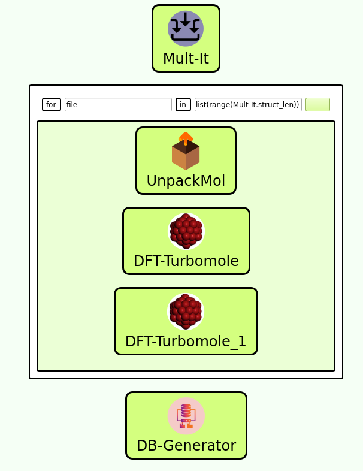
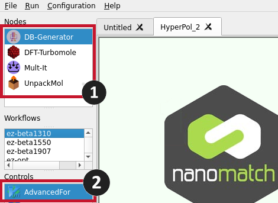
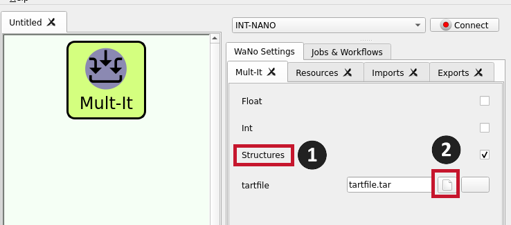
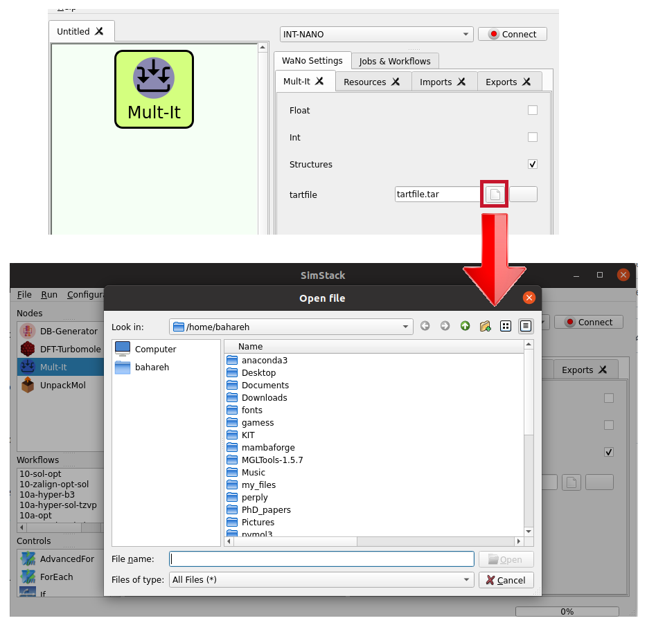
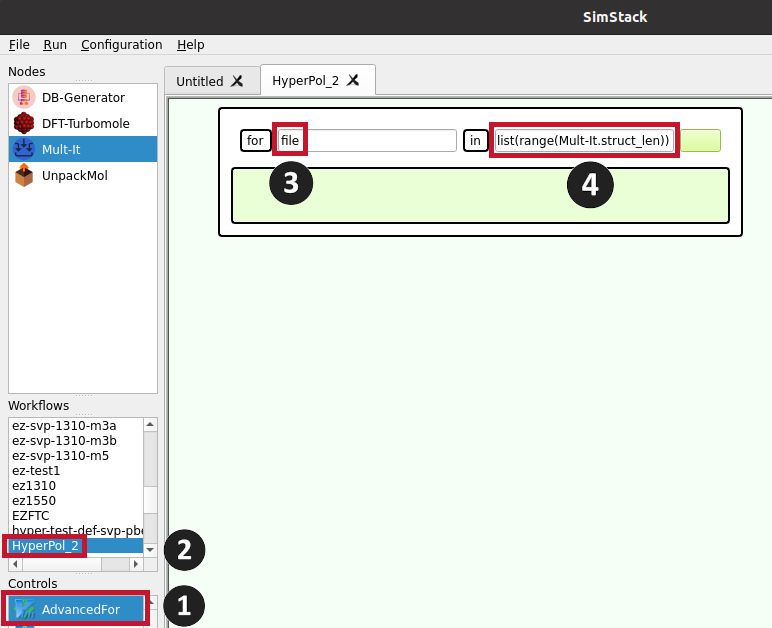
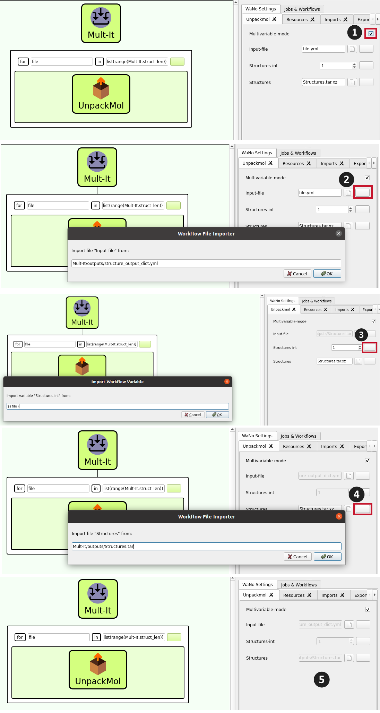
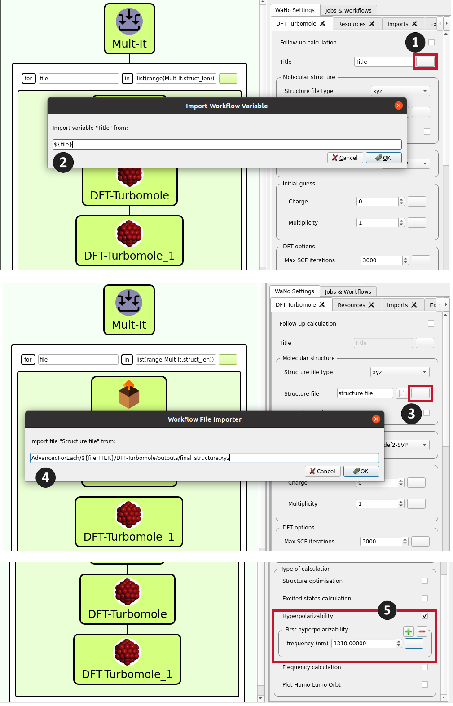
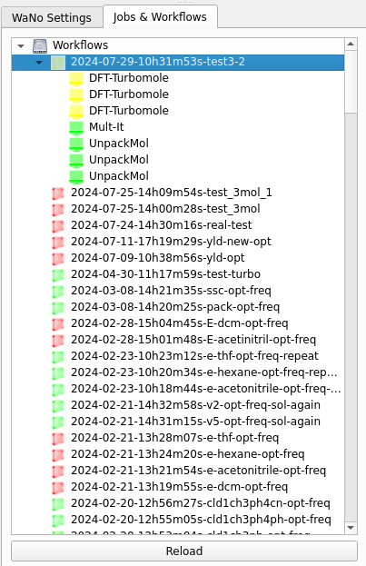

**Welcome to DFT-Turbomole, a WaNo designed for predicting hyperpolarizability in molecules. Our workflow leverages Density Functional Theory (DFT) calculations using the Turbomole software suite. This WaNo enables efficient computation and screening of hyperpolarizability across a diverse range of molecular structures.**
---
## Table of Contents
- [DFT-Turbomole WaNo](#dft-turbomole-wano)
- [Workflow Creation in Simstack](#workflow-creation-in-simstack)
- [Wanos](#wanos)
  - [Mul-It](#mul-it)
  - [AdvancedFor](#advancedfor)
  - [UnpackMol](#unpackmol-wano)
  - [DFT-Turbomole](#dft-turbomole-wano)
  - [DTF-Turbomole_1](#dtf-turbomole_1-wano)
  - [DB-Generator](#db-generator-wano)
- [Parameters](#parameters)
- [Running](#running)

# DFT-Turbomole WaNo

The DFT-Turbomole WANO is a workflow automation tool designed for computational chemistry tasks, focusing primarily on hyperpolarizability calculations. This tool facilitates the calculation of various molecular properties, including:
- Geometry optimization
- Frequency calculation
- Excited state calculation
- Hyperpolarizability calculation

These calculations can be performed for molecules in both gas phase and solution environments. However, the primary purpose of this workflow automation tool is to streamline hyperpolarizability calculations, aiding in the screening and assessment of molecular candidates for applications in nonlinear optics and related fields. Figure 1 depicts the workflow layout.

<figure align="centering">
    
    <figcaption>Figure 1: This figure illustrates the workflow for calculating hyperpolarizability. The workflow encompasses the following components: Mult-It, UnpackMol, DFT-Turbomole, DFT-Turbomole_1, DB-Generator Wanos, and a for loop.
</figcaption>
</figure>

This document describes the components of the workflow and provides instructions on how to use them.
# Workflow Creation in Simstack
Upon launching Simstack, navigate to the top left corner of the screen where you'll find all necessary Wanos modules listed under the "Nodes" section (refer to Number 1 in Figure 2). The "AdvancedFor" for loop is situated within the "Controls" section (see Number 2 in Figure 2).

## Creating a Workflow
To construct your workflow, follow these steps:

1- **Drag and Drop:** Begin by dragging the Wanos modules and the "AdvancedFor" loop into your workspace in the specified order:
 - Mult-It
 - AdvancedFor
 - UnpackMol
 - DFT-Turbomole (twice; the first instance for geometry optimization calculations, and the second instance, named DFT-Turbomole_1, for hyperpolarizability calculations)
 - DB-Generator

2- **Configure the Loop:** Ensure that UnpackMol, DFT-Turbomole, and DFT-Turbomole_1 are encapsulated within the "AdvancedFor" loop as depicted in Figure 1.

3- **Adjustment:** You can reposition and reorder the modules on the screen by clicking and dragging them as needed.

## Note 
Carefully place and order the UnpackMol, DFT-Turbomole, and DFT-Turbomole_1 modules within the "AdvancedFor" loop to ensure the workflow operates correctly.

<figure align="centering">
    
    <figcaption>Figure 2: This figure illustrates the placement of all Wanos components and loops required to create a workflow.
</figcaption>
</figure>

All components will be explained in the following section.

# Wanos
## Mul-It
This Wano (Figure 3) allows users to upload multiple input files simultaneously. Users should prepare all necessary structure files in a folder and create a tar file on their own computer. Although there are various options available in this Wano, the only essential option is "structure" (see number 1 in Figure 3). The rest of the options should remain unchanged for this workflow. By selecting "structure," the "tarfile" section will appear. Clicking the paper icon next to the filename box (number 2 in Figure 3) will guide the user to the desktop paths (Figure 4), where the tar file can be located and selected.

<figure align="centering">
    
    <figcaption>Figure 3: Overview of Wano interface showing key user options. Note the 'structure' option at position 1, essential for this workflow.
</figcaption>
</figure>

<figure align="centering">
    
    <figcaption>Figure 4: File selection interface accessed by clicking the paper icon near the filename box (shown in Figure 3). This interface helps users navigate and select the necessary tar file from their desktop paths.
</figcaption>
</figure>

## AdvancedFor
To use the For loop in the workspace, simply drag the "AdvancedFor" from the "Controls" section (see number 1 in Figure 5) and drop it into the workspace. This workflow processes all files previously uploaded via the tar file using the "Mult-It" Wano, performing the desired action on them. The loop variable should always be named "file" for the for command (see number 3 in Figure 5), and the command should be set to "list(range(Mult-It.struct_len))" for this Wano (see number 4 in Figure 5). To use this command, double-click on "HyperPol_2" under the "Workflows" section (see number 2 in Figure 5).

<figure align="centering">
    
    <figcaption>Figure 5: Workspace setup showing the placement of 'AdvancedFor' in the workflow, key configuration fields for the for loop, and how to initiate the command in the 'Mult-It' Wano.
</figcaption>
</figure>

# UnpackMol Wano

UnpackMol Wano extracts and processes files from the tar file uploaded using Mult-It. Follow the steps below to correctly set up and use UnpackMol Wano.

## Steps to Use UnpackMol Wano

1. **Open UnpackMol Wano:**
   - Double-click on the UnpackMol Wano icon in the workspace. The related parameters will appear (see Figure 6, number 1).

2. **Enable Multivariable Mode:**
   - Check the "Multivariable mode" box as shown in Figure 6, number 1.

3. **Select Input File:**
   - Click on the button next to the "input file" section (Figure 6, number 2).
   - In the window that appears, type the first three or four letters of "Mult-It". A list will pop up.
   - From the list, select `Multi-It/outputs/structure_output_dict.ylm`. This means UnpackMol Wano will extract the structure from the output of Mult-It, which is delivered as a list.

4. **Set Structures-Int:**
   - Click the button next to the "structures-int" section and select `${file}` (Figure 6, number 3).

5. **Select Structures File:**
   - For the final box labeled "structures", click the button and select `Mult-It/outputs/Structures.tar` (Figure 6, number 4).

6. **Complete Setup:**
   - Once all sections are filled, all fields will be deactivated (Figure 6, number 5).

## Notes

- This Wano obtains all the necessary data from the Mult-It Wano, which is why all the paths entered start with "Mult-It".

<figure align="centering">
    
    <figcaption>Figure 6: This figure illustrates the process of setting up UnpackMol Wano, including enabling multivariable mode (1), selecting the input file (2), setting structures-int (3), and choosing the structures file (4). Once all fields are filled, they become deactivated (5).
</figcaption>
</figure>

## DFT-Turbomole Wano

### Step-by-Step Guide

1. **Activate DFT-Turbomole**
    - After setting up `UnpackMol`, double-click on `DFT-Turbomole` to activate it.

2. **Configure Parameters**
    - Click on the Wano icon to display the parameters (refer to Figure 7).
    
    ### Title Configuration
    - Click on the title box (labeled as 1 in Figure 7).
    - Select `${file}` (labeled as 2 in Figure 7).

    ### Structure File Setup
    - Click on the box next to "structure file" under the "molecular structure" section (labeled as 3 in Figure 7).
    - Fill in the box with the path: `AdvancedForEach/${file_ITER}/UnpackMol/outputs/Mol_geom.xyz` (as shown in Figure 7, labeled as 4). (type a few letters of AdvancedForEach, then select this expresion among the list)

3. **Select Additional Parameters**
    - Configure the rest of the parameters under the following sections:
        - **Basis set**
        - **Initial guess**
        - **DFT options**
    - Detailed explanations of these parameters are provided in the next section.
  
<figure align="centering">
    
    <figcaption>Figure 7: Configuration interface for DFT-Turbomole. 
</figcaption>
</figure>

4. **Type of Calculation**
    - Tick the "structure optimization" and "Frequency calculation" options under the "Type of calculation" section (refer to Figure 8).
<figure align="centering">
    
    <figcaption>Figure 8:  Selection interface for the type of calculation in DFT-Turbomole. Ensure that both "structure optimization" and "Frequency calculation" options are ticked to enable geometry optimization and frequency calculation.
</figcaption>
</figure>
 

This setup will enable the Wano to grab the initial structures from the `UnpackMol` Wano and perform geometry optimization and frequency calculation.

#  DTF-Turbomole_1 WANO

To perform hyperpolarizability calculations using the DTF-Turbomole_1 WANO, follow these steps:

1. **Open the WANO**: Double-click on the DTF-Turbomole_1 WANO.

2. **Input Structure**: This WANO takes the optimized structure from the DFT-Turbomole WANO as the initial input for hyperpolarizability calculation.

3. **Define a Title**: 
    - Click the button next to the "Title" field (see Figure 9, number 1).
    - Fill in the title as shown in Figure 9, number 2.

4. **Specify the File**:
    - Click on the box next to "Structure file" under the "Molecular structure" section (number 3 in Figure 9).
    - Select the appropriate file by typing a few letters of "AdvancedForEach." A pop-up will appear where you can select the file from the list (see Figure 9, number 4).

5. **Type of Calculation**:
    - Check the box next to "Hyperpolarizability" under the "Type of calculation" section (number 5 in Figure 9).
    - A box will appear where you can enter your desired Lambda in nm.
    - If additional frequencies are needed, press the green cross to add another frequency in the new box that appears.

**Note**: In this WANO, the default hyperpolarizability calculation is the Pockels effect. For more details, please refer to the parameters explanation.

<figure align="centering">
    
    <figcaption>Figure 9:  Steps to Set Up Hyperpolarizability Calculation in DTF-Turbomole_1 WANO.
</figcaption>
</figure>

# DB-Generator WANO

To generate a database using the DB-Generator WANO, follow these steps:

1. **Open the WANO**: Double-click on the DB-Generator WANO.

2. **Set Parameters**: The parameters shown in Figure 10 will appear. 

3. **Change "DB-name"**:
    - Enter an arbitrary name for "DB-name".
    - Leave the other parameters unchanged.

This WANO collects all generated data from the previous WANO and generates a database.

<figure align="centering">
    
    <figcaption>Figure 10:  Parameter Settings for DB-Generator WANO.
</figcaption>
</figure>

# Parameters
In this section, we will explain each of the following parameters in detail:
- **Title:** Provide the title of the calculation or project (should be defined as explained in the previous sections).
- **Molecular Structure**
    - _**Structure file type:**_ Specify the type of structure file being used (XYZ, Turbomole coord, Gaussian input).
    - _**Structure file:**_ The actual structure file containing the molecular coordinates (should be defined as explained in the previous sections).
    - _**Internal coordinates:**_ Information on the internal coordinates used for defining the molecule.
- **Basis set**
    - _**Basis set type:**_ Specify the type of basis set employed in the calculation.
- **Initial guess**
    - _**Charge:**_ Indicate the total charge of the molecule.
    - _**Multiplicity:**_ Specify the multiplicity of the molecule.
- **DFT options**
    - _**Max SCF iterations:**_ Set the maximum number of SCF (Self-Consistent Field) iterations.
    - _**Use RI:**_ Specify whether the RI (Resolution of Identity) approximation is used.
    - _**Memory for RI:**_ Allocate memory for RI calculations.
    - _**Functional:**_ Specify the DFT functional used.
    - _**Integration grid:**_ Define the integration grid used for the DFT calculations.
    - _**vdw correction:**_ Indicate if van der Waals correction is needed.
    - _**COSMO calculation:**_ Specify if COSMO calculations are needed.
- **Type of calculation**
    - _**Structure optimization:**_ Performing geometry optimization if you select this option. The final structure will be stored in the output directory.
    - _**Excited states calculation:**_ Computing the electronic states of a molecule that are higher in energy than the ground state using the Time-Dependent Density Functional Theory (TD-DFT) method.
    - _**Hyperpolarizability:**
         - The equation ω₃ = −(ω₁ + ω₂) is fundamental in describing energy conservation in three-wave mixing processes in nonlinear optics. Here are some useful special cases:
           
         - **Second Harmonic Generation (SHG), β(−2ω; ω, ω)**: Two photons of the same frequency (ω) combine to generate a new photon with twice the frequency (2ω). Commonly used in laser technology for frequency doubling.
           
         - **Electro-optic Pockels Effect, β(−ω; ω, 0)**: A light wave (ω) interacts with a static electric field, resulting in modulation of the light wave at the same frequency. Utilized in electro-optic modulators for optical communication systems.
           
         - **Optical Rectification, β(0; ω, −ω)**: Two photons of opposite frequencies (ω and −ω) generate a static (DC) electric field. Used in terahertz wave generation and detection.
         
 Although Turbomole software calculates the hyperpolarizability by default for the second harmonic generation case, this WANO is designed to calculate hyperpolarizability for the Pockels effect.
       
The resulting hyperpolarizability is in atomic units (a.u.). To convert it to esu `\(*10^{30}\)`, use the following relation:

`1 a.u. = \(8.6393 \times 10^{-33}\) esu`

  - _**Frequency calculation:**_ Calculate second derivatives of the energy with respect to nuclear positions. This can be chosen either with the structure optimization parameter or alone.
  - _**Plot HOMO-LUMO orbt:**_  If you need to see the frontier orbitals, selecting this parameter will calculate the related cube files.

## Running

1. **Define the Appropriate Resources**
   - Click on the "Resources" button on the top right side of Simstack.
   - Define your needed processors by changing the value in the "cpus_per_node" box and allocate enough memory in the "memory" field.
   - Adjust the walltime, which is the time limit you need to run your calculation. The more complicated the structure, the more time you should assign.
   - Please leave the rest of the parameters unchanged.

2. **Save the Configuration**
   - Click on "File" (top left side of Simstack), select "Save As", and give it a name.

3. **Run the Calculation**
   - Click on the "Run" button (next to "File").

4. **Check the Progress**
   - On the right-hand side of Simstack, click on "Jobs & Workflows" to check the progress (Figure 11).
   - Yellow color indicates the running status, green means successfully finished, and red shows an error.
   - To update the status, press the "Reload" button at the bottom of the page.
   - For each structure in your tar file, a folder will be created for each WANO. For example, if there are three structures as shown in Figure 11, three directories will be created for the UnpackMol and DFT-Turbomole WANOs.

<figure align="centering">
    
    <figcaption>Figure 11:  Monitoring Job and Workflow Progress in Simstack.
</figcaption>
</figure>
  
