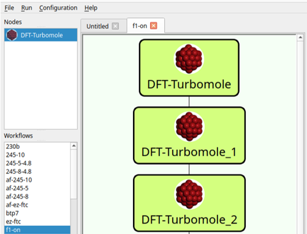
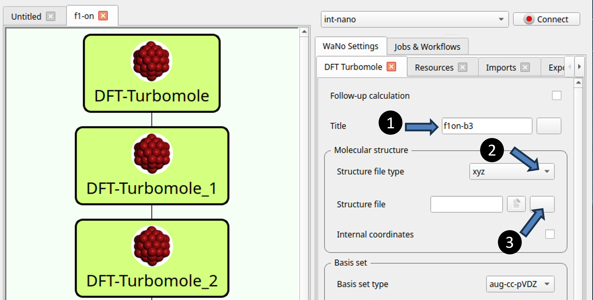
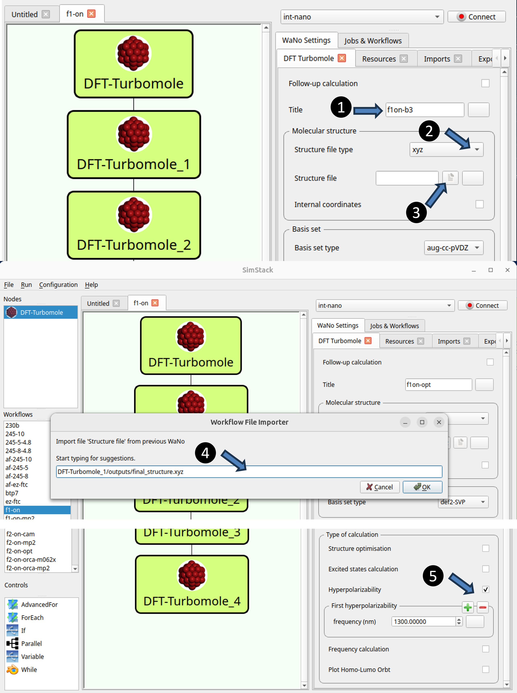
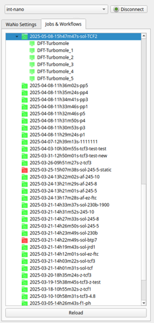

**Welcome to DFT-Turbomole, a WaNo designed for predicting hyperpolarizability in molecules. Our workflow leverages Density Functional Theory (DFT) calculations using the Turbomole software suite. This WaNo enables efficient computation and screening of hyperpolarizability across a diverse range of molecular structures.**
---
## Table of Contents
- [DFT-Turbomole WaNo](#dft-turbomole-wano)
- [Workflow Creation in Simstack](#workflow-creation-in-simstack)
- [Wanos](#wanos)
  - [DFT-Turbomole](#dft-turbomole-wano)
  - [DTF-Turbomole_1](#dtf-turbomole_1-wano)
- [Parameters](#parameters)
- [Running](#running)

# DFT-Turbomole WaNo

The DFT-Turbomole WANO is a workflow automation tool designed for computational chemistry tasks, focusing primarily on hyperpolarizability calculations. This tool facilitates the calculation of various molecular properties, including:
- Geometry optimization
- Frequency calculation
- Excited state calculation
- Hyperpolarizability calculation

These calculations can be performed for molecules in both gas phase and solution environments. However, the primary purpose of this workflow automation tool is to streamline hyperpolarizability calculations, aiding in the screening and assessment of molecular candidates for applications in nonlinear optics and related fields. Figure 1 depicts the workflow layout.

<figure align="centering">
    
    <figcaption>Figure 1: This figure illustrates the workflow for calculating hyperpolarizability. The workflow encompasses the following components: DFT-Turbomole, DFT-Turbomole_1, DFT-Turbomole_2 Wanos, and a for loop.
</figcaption>
</figure>

This document describes the components of the workflow and provides instructions on how to use them.
# Workflow Creation in Simstack
Upon launching Simstack, navigate to the top left corner of the screen, where you'll find the Wano module listed under the "Nodes" section. 

## Creating a Workflow
To construct your workflow, follow these steps:

1- **Drag and Drop:** Begin by dragging the Wanos modules and the "AdvancedFor" loop into your workspace in the specified order:
 - DFT-Turbomole (The first instance for geometry optimization calculations)
 - DFT-Turbomole1 (The second instance for hyperpolarizability calculations )
 - DFT-Turbomole2 (The third instance for hyperpolarizability calculations with different methods)

2- **Adjustment:** You can reposition and reorder the modules on the screen by clicking and dragging them as needed.

## DFT-Turbomole Wano

### Step-by-Step Guide

1. **Activate DFT-Turbomole**
    - After dragging `DFT-Turbomole` to the center window, double-click on `DFT-Turbomole` to activate it.

2. **Configure Parameters**
    - Click on the Wano icon to display the parameters (refer to Figure 2).
    
    ## Title Configuration
    - Click on the title box and name it (labeled as 1 in Figure 2).

    ## Structure File Setup
    - Click on the box next to "Structure file type" under the "Molecular structure" section (labeled as 2 in Figure 2). Default is xyz.
    - Click on the box next to "Structure file" under the "Molecular structure" section (labeled as 3 in Figure 2). Choose and upload the xyz file, or manually enter the file path. 

3. **Select Additional Parameters**
    - Configure the rest of the parameters under the following sections:
        - **Basis set**
        - **Initial guess**
        - **DFT options**
    - Detailed explanations of these parameters are provided in the next section.
  
<figure align="centering">
    
    <figcaption>Figure 2: Configuration interface for DFT-Turbomole. 
</figcaption>
</figure>

4. **Type of Calculation**
    - Tick the "structure optimization" and "Frequency calculation" options under the "Type of calculation" section (refer to Figure 3).
<figure align="centering">
    
    <figcaption>Figure 3:  Selection interface for the type of calculation in DFT-Turbomole. Ensure that both the "Structure Optimization" and "Frequency calculation" options are selected to enable geometry optimization and frequency calculation.
</figcaption>
</figure>
 

This setup will enable the Wano to extract the initial structures from the `structure file` and perform geometry optimization and frequency calculations. It will generate a new optimized xyz file for the next step.

#  DTF-Turbomole_1 WANO

To perform hyperpolarizability calculations using the DTF-Turbomole_1 WANO, follow these steps:

1. **Open the WANO**: Double-click on the DTF-Turbomole_1 WANO.

2. **Define a Title**: 
    - Click on the title box and name it (see Figure 4, number 1).

3. **Input Structure**: 

4. **Specify the File**:
    - Click on the box next to "Structure file type" under the "molecular structure" section (labeled as 2 in Figure 4). Default is xyz.
    - Click on the box next to "Structure file" under the "Molecular structure" section (labeled as 3 in Figure 4). Note that this is not the same button as the third step in Figure 2.
    - A pop-up will appear where you can select the file from the list. Select the appropriate file "DTF-Turbomole_1/outputs/final_structure.xyz" (see Figure 9, number 4). This will make the WANO take the optimized structure from the DFT-Turbomole WANO as the initial input for hyperpolarizability calculation. 

5. **Type of Calculation**:
    - Check the box next to "Hyperpolarizability" under the "Type of calculation" section (number 5 in Figure 4).
    - A box will appear where you can enter your desired Lambda in nm.
    - If additional frequencies are needed, press the green cross to add another frequency in the new box that appears.
    - If MP2 calculation is needed, click "MP2" button under "Type of Calculation" (in Figure ?). At this point, there is no need to specify the functional in "DFT Options".

**Note**: In this WANO, the default hyperpolarizability calculation is the Pockels effect. For more details, please refer to the parameters explanation.

<figure align="centering">
    
    <figcaption>Figure 4:  Steps to set up hyperpolarizability calculation in DTF-Turbomole_1 WANO.
</figcaption>
</figure>

# Parameters
In this section, we will explain each of the following parameters in detail:
- **Title:** Provide the title of the calculation or project (should be defined as explained in the previous sections).
- **Molecular Structure**
    - _**Structure file type:**_ Specify the type of structure file being used (xyz, Turbomole coord, Gaussian input).
    - _**Structure file:**_ The actual structure file containing the molecular coordinates (should be defined as explained in the previous sections).
    - _**Internal coordinates:**_ Information on the internal coordinates used for defining the molecule.
- **Basis set**
    - _**Basis set type:**_ Specify the type of basis set employed in the calculation.
- **Initial guess**
    - _**Charge:**_ Indicate the total charge of the molecule.
    - _**Multiplicity:**_ Specify the multiplicity of the molecule.
- **DFT options**
    - _**Max SCF iterations:**_ Set the maximum number of SCF (Self-Consistent Field) iterations.
    - _**Use RI:**_ Specify whether the RI (Resolution of Identity) approximation is used.
    - _**Memory for RI:**_ Allocate memory for RI calculations.
    - _**Functional:**_ Specify the DFT functional used.
    - _**Integration grid:**_ Define the integration grid used for the DFT calculations.
    - _**vdw correction:**_ Indicate if van der Waals correction is needed.
    - _**COSMO calculation:**_ Specify if COSMO calculations are needed.
- **Type of calculation**
    - _**Structure optimization:**_ Performing geometry optimization if you select this option. The final structure will be stored in the output directory.
    - _**Excited states calculation:**_ Computing the electronic states of a molecule that are higher in energy than the ground state using the Time-Dependent Density Functional Theory (TD-DFT) method.
    - _**Hyperpolarizability:**
         - The equation ω₃ = −(ω₁ + ω₂) is fundamental in describing energy conservation in three-wave mixing processes in nonlinear optics. Here are some useful special cases:
           
         - **Second Harmonic Generation (SHG), β(−2ω; ω, ω)**: Two photons of the same frequency (ω) combine to generate a new photon with twice the frequency (2ω). Commonly used in laser technology for frequency doubling.
           
         - **Electro-optic Pockels Effect, β(−ω; ω, 0)**: A light wave (ω) interacts with a static electric field, resulting in modulation of the light wave at the same frequency. Utilized in electro-optic modulators for optical communication systems.
           
         - **Optical Rectification, β(0; ω, −ω)**: Two photons of opposite frequencies (ω and −ω) generate a static (DC) electric field. Used in terahertz wave generation and detection.
         
 Although Turbomole software calculates the hyperpolarizability by default for the second harmonic generation case, this WANO is designed to calculate hyperpolarizability for the Pockels effect.
       
The resulting hyperpolarizability is in atomic units (a.u.). To convert it to esu `\(*10^{30}\)`, use the following relation:

`1 a.u. = \(8.6393 \times 10^{-33}\) esu`

  - _**Frequency calculation:**_ Calculate second derivatives of the energy with respect to nuclear positions. This can be chosen either with the structure optimization parameter or alone.
  - _**Plot HOMO-LUMO orbt:**_  If you need to see the frontier orbitals, selecting this parameter will calculate the related cube files.

## Running

1. **Connect to the server**
   - Click on the "Connect" button in the upper right corner of Simstack.
  
2. **Define the Appropriate Resources**
   - Click on the "Resources" button on the top right side of Simstack.
   - Define your needed processors by changing the value in the "cpus_per_node" box and allocating enough memory in the "memory" field.
   - Adjust the walltime, which is the time limit you need to run your calculation. The more complicated the structure, the more time you should assign.
   - Please leave the rest of the parameters unchanged.

3. **Save the Configuration**
   - Click on "File" (top left side of Simstack), select "Save As", and give it a name.

4. **Run the Calculation**
   - Click on the "Run" button (next to "File").

5. **Check the Progress**
   - On the right-hand side of Simstack, click on "Jobs & Workflows" to check the progress (Figure 5).
   - Yellow color indicates the running status, green means successfully finished, and red shows an error.
   - To update the status, press the "Reload" button at the bottom of the page.

<figure align="centering"> 
  
  <figcaption>Figure 5: Monitoring Job and Workflow Progress in Simstack.
</figcaption> 
</figure>

  
